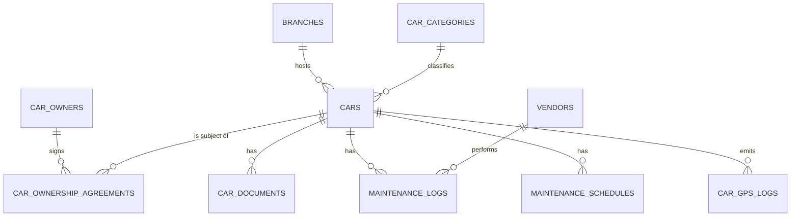
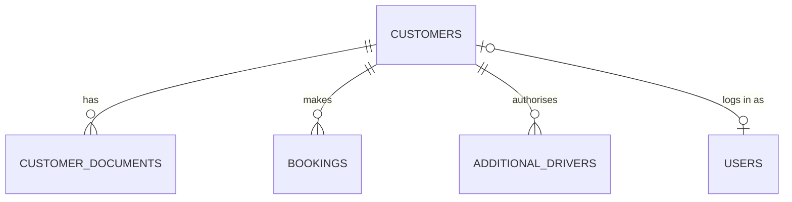
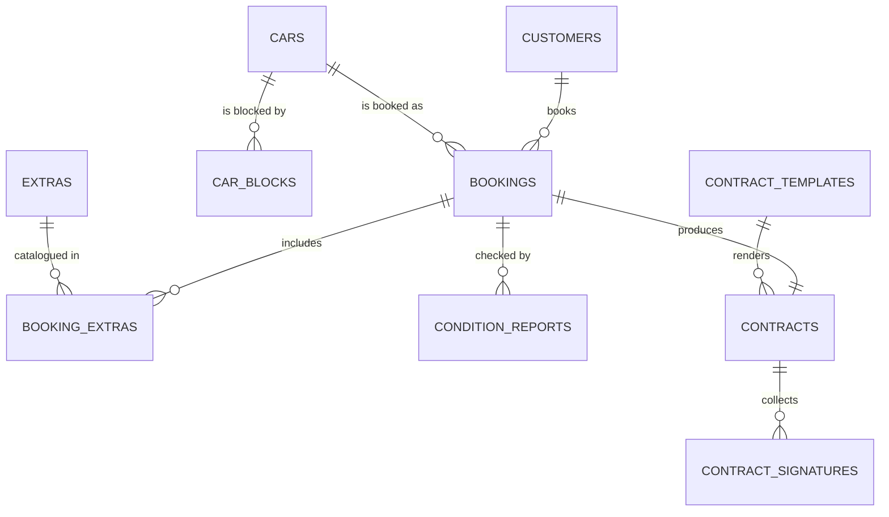
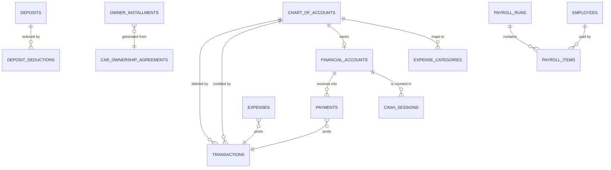
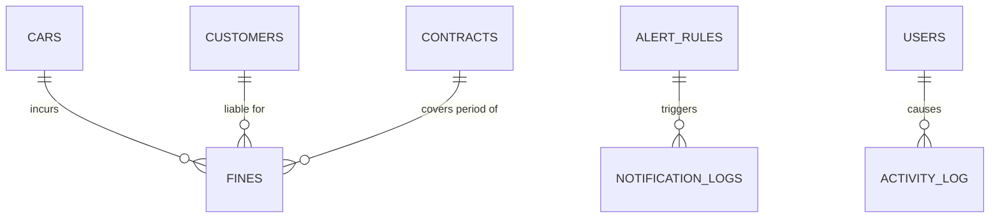

# 01 — Database Schema (Textual ERD)

Target engine: **PostgreSQL 16+**. See [`06-design-decisions.md`](06-design-decisions.md) ADR-002 for why.

## Global conventions

Applied to every table unless stated otherwise.

| Rule | Detail |
|---|---|
| Primary key | `id` — `bigIncrements`. Public-facing entities (contracts, bookings, transactions) additionally carry a `uuid` and a human `reference`. |
| Money | `decimal(18, 2)`, cast `decimal:2`. **Never** `float`/`double`. Currency default `DZD`. |
| Dates | `timestamptz` for moments (`pickup_at`), `date` for accounting periods (`occurred_on`). App timezone `Africa/Algiers`. |
| Soft deletes | On master data (`cars`, `customers`, `car_owners`, `users`, `employees`, `vendors`). **Never** on `transactions` — the ledger is append-only. |
| Audit columns | `created_by_id`, `updated_by_id` → `users`, on every operational table. |
| Branch | `branch_id` → `branches`, **nullable, present from Phase 1** on every operational and financial table. Enforcement (global scope, switcher) turns on in Phase 10. See ADR-004. |
| Enums | Stored as `varchar` + PHP backed enum + a DB `check` constraint. Not native PG enums (painful to alter). Catalogue: [`07-enums.md`](07-enums.md). |
| Files | Spatie Media Library. No `*_path` columns except the generated contract PDF snapshot. |
| Naming | Tables plural snake_case, FK `{singular}_id`, booleans `is_*`/`has_*`, timestamps `*_at`. |

### Columns that deliberately do **not** exist

These are the tempting denormalisations that would break the single-ledger invariant (REQ-08). They are
banned; the value is always a query over `transactions`.

- `bookings.paid_amount`, `bookings.balance_due`
- `customers.total_spent`, `customers.outstanding_balance`
- `cars.total_revenue`, `cars.total_expenses`, `cars.net_profit`
- `car_owners.balance`, `owner_installments.amount_paid`, `owner_installments.remaining_balance`
- `financial_accounts.current_balance`
- `deposits.refunded_amount`

The single exception is `ledger_daily_balances` — an explicitly labelled, **rebuildable cache**
(see [Finance](#module-4--finance)).

---

## Module 1 — Fleet



### `branches` — ADV-06
`id`, `name`, `code` (unique, used in document numbering), `address`, `city`, `wilaya`, `phone`,
`email`, `manager_id` → users, `timezone`, `is_active`, `is_default`.
**1-M** → almost everything.

### `car_categories`
`id`, `name` (Economy / Compact / SUV / Luxury / Utility / Van), `slug`, `description`, `sort_order`, `is_active`.
**1-M** → cars. Used for default pricing tiers and fleet reporting.

### `car_owners` — REQ-03
`id`, `branch_id`, `user_id` (nullable → owner-panel login), `type` (`individual|company`),
`first_name`, `last_name`, `company_name`, `trade_register`, `national_id`,
`phone`, `whatsapp`, `email`, `address`, `wilaya`,
`bank_name`, `bank_rib`, `ccp_account`, `baridimob_number`,
`notes`, `is_active`.

- **1-M** → `car_ownership_agreements`, `owner_installments`
- **1-1 (nullable)** → `users` — a `car_owner` role user, gateway to the owner panel
- Owner's financial position is **derived** from `transactions` where `car_owner_id = X`.

### `car_ownership_agreements` — REQ-03
The commercial arrangement between the company and an external owner for one car.
Separated from `cars` so terms can change over time without destroying history.

`id`, `car_id`, `car_owner_id`, `branch_id`,
`model` (`fixed_monthly | revenue_share | hybrid`),
`monthly_rent_amount` (fixed_monthly / hybrid),
`share_percentage` (revenue_share / hybrid),
`start_date`, `end_date` (nullable = open-ended),
`payment_day_of_month` (1–28), `installments_count` (nullable = indefinite),
`first_due_date`, `grace_days`,
`status` (`draft | active | suspended | ended`),
`contract_file` (media), `notes`.

- **M-1** → `cars`, **M-1** → `car_owners`
- **1-M** → `owner_installments` (generated monthly by a scheduled job)
- Constraint: no two `active` agreements may overlap for the same `car_id` — enforced with the same
  Postgres `EXCLUDE` technique used for bookings.

### `cars` — REQ-02
`id`, `branch_id`, `car_category_id`, `car_owner_id` (nullable — null ⇒ company-owned),
`ownership_type` (`company_owned | third_party`),

*Identity* — `brand`, `model`, `trim`, `year`, `color`, `body_type`, `transmission`, `fuel_type`,
`seats`, `doors`, `chassis_number` (VIN, **unique**), `engine_number`, `registration_number`
(plate, **unique**), `registration_date`,

*State* — `status` (`available | reserved | rented | maintenance | out_of_service | sold | returned_to_owner`),
`odometer`, `odometer_updated_at`, `fuel_level`,

*Pricing* — `daily_rate`, `weekly_rate`, `monthly_rate`, `security_deposit_amount`,
`mileage_limit_per_day`, `extra_km_price`, `late_hour_fee`,

*Acquisition (company-owned)* — `purchase_date`, `purchase_price`, `current_value`,

*Document expiry mirrors* — `insurance_expiry_date`, `technical_inspection_expiry_date`,
`registration_expiry_date`, `road_tax_expiry_date`. **Derived cache** of the latest valid row per
type in `car_documents`, kept current by an observer. Present only so the fleet list can be filtered
and sorted cheaply; `car_documents` remains the source of truth.

*Telematics* — `gps_device_id`, `gps_provider`,

`notes`, `is_active`.

- **M-1** → branch, category, owner
- **1-M** → `car_documents`, `maintenance_logs`, `maintenance_schedules`, `bookings`, `contracts`,
  `car_blocks`, `fines`, `car_gps_logs`, and `transactions` (as a dimension)
- Photos: Media Library collections `gallery` and `damage`. No `car_photos` table — see ADR-009.
- Profit / expenses / rental days / utilisation (REQ-02, REQ-11): **queries**, never columns.

### `car_documents` — REQ-13
`id`, `car_id`, `type` (`insurance | registration_card | technical_inspection | road_tax_vignette |
ownership_title | purchase_invoice | gps_subscription | other`),
`number`, `issuer`, `issue_date`, `expiry_date`, `cost`, `reminder_days_before`,
`replaced_by_id` (nullable self-FK → renewal chain), `notes`.
Files via Media Library. `status` (valid / expiring / expired) is a **computed accessor**, not a column.

- **M-1** → `cars`
- Renewal cost posts an expense transaction stamped with `car_id` → lands in that car's P&L.
- Drives the expiring-documents widget and the REQ-17 alert.

### `maintenance_logs` — REQ-12
`id`, `car_id`, `branch_id`, `vendor_id` (nullable),
`type` (`oil_change | tire_change | brakes | filters | general_service | repair | body_work |
battery | diagnostics | cleaning | other`),
`status` (`scheduled | in_progress | completed | cancelled`),
`scheduled_for`, `started_at`, `completed_at`,
`odometer_at_service`,
`cost_parts`, `cost_labour`, `total_cost`, `invoice_number`,
`next_due_date`, `next_due_odometer`,
`performed_by_id` → users, `description`, `notes`.
Attachments via Media Library.

- **M-1** → `cars`, `vendors`
- On `completed`: posts a maintenance expense stamped `car_id`; updates `cars.odometer`; releases the
  `car_blocks` row; recalculates the matching `maintenance_schedules` row.

### `maintenance_schedules` — REQ-12
Turns "next service due" from a manually-typed date into something the system computes.

`id`, `car_id` (nullable) or `car_category_id` (nullable — template-level),
`task_type` (same enum as `maintenance_logs.type`),
`interval_km`, `interval_days`,
`last_done_at`, `last_done_odometer`,
`next_due_at`, `next_due_odometer` (recomputed on each completed log),
`alert_km_before`, `alert_days_before`, `is_active`.

- **M-1** → `cars`
- Feeds REQ-17 maintenance alerts. Whichever of km/date arrives first triggers.

### `vendors`
`id`, `branch_id`, `name`, `type` (`garage | insurance | parts | fuel_station | towing | other`),
`contact_name`, `phone`, `email`, `address`, `notes`, `is_active`.
**1-M** → `maintenance_logs`, `expenses`.

### `car_gps_logs` — REQ-02 (optional)
`id`, `car_id`, `recorded_at`, `latitude`, `longitude`, `speed_kmh`, `heading`, `ignition_on`,
`raw` (jsonb).
High volume. Declared as a **partitioned table by month**, pruned after N months, and excluded from
backups of the operational set. Only build this when a GPS provider is actually contracted.

---

## Module 2 — CRM



### `customers` — REQ-04
`id`, `branch_id`, `user_id` (nullable → client-panel login), `code` (unique),
`type` (`individual | company`),

*Individual* — `first_name`, `last_name`, `date_of_birth`, `place_of_birth`, `nationality`, `gender`,
`national_id` (NIN),

*Company* — `company_name`, `trade_register`, `article_number` (NIS),

*Licence* — `driving_license_number`, `license_category`, `license_issue_date`,
`license_expiry_date`, `license_issued_at`,

*Contact* — `phone`, `phone_secondary`, `whatsapp`, `email`, `address`, `city`, `wilaya`, `country`,

*Commercial* — `rating` (1–5), `is_blacklisted`, `blacklist_reason`, `blacklisted_at`,
`source` (`walk_in | referral | website | facebook | instagram | partner | other`),
`notes`, `is_active`.

- **1-M** → `customer_documents`, `bookings`, `contracts`, `fines`, `deposits`
- **1-1 (nullable)** → `users`
- Contract history / amounts owed / deposits / fines (REQ-04): **all derived** —
  amounts owed = balance of the *Accounts Receivable – Customers* account filtered to `customer_id`.

### `customer_documents` — REQ-04, ADV-02
`id`, `customer_id`, `type` (`national_id | driving_license | passport | residence_proof |
company_register | other`), `number`, `issue_date`, `expiry_date`,
`verified_at`, `verified_by_id` → users, `notes`. Files via Media Library (front/back).

- **M-1** → `customers`
- Expiring driving licence feeds REQ-17 alerts and blocks booking confirmation when expired.

### `additional_drivers`
`id`, `booking_id`, `customer_id` (nullable — may be a non-customer), `full_name`,
`national_id`, `driving_license_number`, `license_expiry_date`, `date_of_birth`, `phone`.
Files via Media Library.
**M-1** → `bookings`. Named on the contract and legally relevant for fine liability (REQ-14).

---

## Module 3 — Booking & Contracts



### `bookings` — REQ-05, ADV-01
`id`, `uuid`, `reference` (`BK-2026-000123`, unique), `branch_id`,
`car_id`, `customer_id`, `created_by_id`, `sales_agent_id`,

`status` (`draft | pending | confirmed | active | completed | cancelled | no_show | overdue`),

*Period* — `pickup_at`, `expected_return_at`, `actual_pickup_at`, `actual_return_at`,
`pickup_branch_id`, `return_branch_id`, `pickup_location`, `return_location`,

*Pricing snapshot* — `daily_rate`, `days_count`, `subtotal`, `extras_total`,
`discount_amount`, `discount_reason`, `total_amount`,
`security_deposit_amount`,

*Handover* — `odometer_out`, `odometer_in`, `fuel_level_out`, `fuel_level_in`,
`with_driver`, `driver_employee_id`,

`cancellation_reason`, `cancelled_at`, `cancelled_by_id`, `notes`.

- **M-1** → cars, customers, branch; **1-1** → `contracts`; **1-M** → `booking_extras`,
  `condition_reports`, `additional_drivers`, `payment_schedules`
- **Rates are snapshotted onto the booking.** Changing `cars.daily_rate` must never retroactively alter
  a past booking's price.
- Paid / outstanding: **derived from the ledger**, no columns.

**Double-booking prevention (REQ-05)** — enforced by the database, not by application code:

```sql
ALTER TABLE bookings ADD CONSTRAINT bookings_no_overlap
  EXCLUDE USING gist (
    car_id WITH =,
    tstzrange(pickup_at, expected_return_at, '[)') WITH &&
  ) WHERE (status IN ('confirmed', 'active', 'overdue'));
```
Requires `CREATE EXTENSION btree_gist`. Two concurrent requests for the same car and overlapping dates:
one commits, the other gets a `23P01` exclusion violation which the app translates into a friendly
validation error. The race condition is unreachable. `draft`/`pending` are excluded so quotes can overlap.

### `car_blocks` — REQ-05, REQ-12
Non-booking reasons a car is unavailable, on the same calendar so the two can never disagree.

`id`, `car_id`, `branch_id`, `reason` (`maintenance | owner_use | inter_branch_transfer |
insurance_claim | administrative | other`),
`starts_at`, `ends_at`, `maintenance_log_id` (nullable), `notes`, `created_by_id`.

Carries a matching `EXCLUDE` constraint against itself, **and** a trigger-based check against
`bookings` so a car cannot be simultaneously blocked and rented.

### `extras` / `booking_extras` — REQ-08 (additional services revenue)
`extras`: `id`, `name`, `code`, `pricing_unit` (`per_day | per_rental | per_km`), `unit_price`,
`ledger_account_id` (which revenue account it credits), `is_active`.
Catalogue: GPS unit, child seat, additional driver, delivery, collection, full-insurance upgrade,
cross-wilaya permission.

`booking_extras`: `id`, `booking_id`, `extra_id`, `quantity`, `unit_price` (snapshot), `total`.
**M-M** between bookings and extras with payload.

### `condition_reports` — ADV-07
`id`, `booking_id`, `type` (`checkout | checkin`), `performed_at`, `performed_by_id`,
`odometer`, `fuel_level`, `is_clean`,
`damage_points` (jsonb — coordinates on the car diagram + severity + note per point),
`customer_signature` (media), `notes`.
Photos via Media Library.
**M-1** → `bookings`. Basis for deposit deductions (`deposit_deductions`) and damage-recovery revenue.

### `contract_templates` — REQ-06
`id`, `branch_id` (nullable = global), `name`, `locale` (`ar | fr | en`), `body` (Blade/HTML with
placeholders), `terms_version`, `is_active`, `is_default`.
**1-M** → `contracts`.

### `contracts` — REQ-06, ADV-02
`id`, `uuid`, `contract_number` (unique, sequential per branch+year via `sequences`), `branch_id`,
`booking_id`, `car_id`, `customer_id`, `contract_template_id`,

`status` (`draft | awaiting_signature | signed | active | closed | cancelled | amended`),

`content_snapshot` (jsonb) — **the rendered terms and all party/vehicle/price data frozen at
generation time**. The contract must remain readable exactly as signed even after the car is sold, the
price list changes or the template is edited. See ADR-005.

`terms_version`, `insurance_type` (`basic | full`), `franchise_amount`,
`generated_at`, `pdf_disk`, `pdf_path`, `document_hash` (SHA-256 of the signed PDF),
`sent_at`, `sent_channel`, `sent_to`,
`signed_at`,
`closed_at`, `closed_by_id`, `closing_notes`, `has_damages`,
`parent_contract_id` (nullable self-FK — extensions and amendments chain).

- **1-1** → `bookings`; **1-M** → `contract_signatures`
- Delivery attempts are logged in `notification_logs`, not here.

### `contract_signatures` — REQ-06
`id`, `contract_id`,
`signer_role` (`customer | additional_driver | company_representative | guarantor`),
`signer_type` + `signer_id` (polymorphic → Customer / User / AdditionalDriver),
`signer_name_snapshot`,
`method` (`drawn | otp | uploaded_scan | in_person_paper`),
`signature_image` (media),
`otp_code_hash`, `otp_sent_to`, `otp_sent_at`, `otp_verified_at`, `otp_attempts`,
`document_hash` (SHA-256 of the PDF **as it was at the moment this party signed**),
`signed_at`, `ip_address`, `user_agent`, `geolocation` (jsonb).
**M-1** → `contracts`. Rows are append-only.

---

## Module 4 — Finance

**This module is the heart of the system.** Read [`05-accounting-model.md`](05-accounting-model.md)
alongside it — that document specifies the exact debit/credit pair for every business event.



### `chart_of_accounts`
`id`, `code` (unique, e.g. `1010`), `name`, `name_ar`, `name_fr`,
`type` (`asset | liability | equity | revenue | expense`),
`parent_id` (self-FK, tree),
`normal_balance` (`debit | credit` — derived from type, stored for query convenience),
`is_cash_equivalent` (bool — true for cash/bank/CCP/BaridiMob, drives the cash register),
`is_postable` (bool — false for parent/heading accounts),
`is_system` (bool — cannot be deleted or renamed by users),
`branch_id` (nullable — per-branch cash boxes get their own account),
`description`, `is_active`.

Seeded, not user-created at will. Full seed list in [`05-accounting-model.md`](05-accounting-model.md).

### `transactions` — **the single ledger**, REQ-08
One row = one balanced double-entry posting.

| Column | Notes |
|---|---|
| `id`, `uuid` | |
| `reference` | `TRX-2026-000123`, unique, from `sequences` |
| `branch_id` | |
| `occurred_on` | `date` — the accounting date (what reports group by) |
| `posted_at` | `timestamptz` — when it was entered (immutable audit) |
| `debit_account_id` | → `chart_of_accounts`, **not null** |
| `credit_account_id` | → `chart_of_accounts`, **not null**, `<> debit_account_id` |
| `amount` | `decimal(18,2)`, **check `amount > 0`** |
| `currency`, `exchange_rate` | default `DZD`, `1.0` |
| `type` | semantic label — `TransactionType` enum, [`07-enums.md`](07-enums.md) |
| `payment_method` | nullable; set only when a cash-equivalent account is one of the legs |
| `description` | human sentence shown in the cash register (REQ-09 "reason") |
| **Dimensions** (all nullable, all indexed) | |
| `car_id` | → per-car profitability, REQ-11 |
| `booking_id`, `contract_id` | |
| `customer_id` | → receivable ageing, REQ-04 |
| `car_owner_id` | → owner statement, REQ-03 |
| `employee_id` | → payroll, advances, commissions, REQ-15 |
| `expense_category_id` | reporting convenience alongside the account |
| **Provenance** | |
| `source_type`, `source_id` | polymorphic → Payment, Expense, Fine, OwnerInstallment, PayrollItem, Deposit, Contract, MaintenanceLog, CashSession |
| `created_by_id` | → users. REQ-09 "who performed it" |
| `cash_session_id` | nullable → which register shift |
| **Corrections** | |
| `reverses_transaction_id` | nullable self-FK |
| `reversed_by_transaction_id` | nullable self-FK |
| `is_reversal` | bool |
| `meta` | jsonb |

**Invariants, enforced in the model and by DB triggers:**
1. **Append-only.** No `UPDATE`, no `DELETE`, no soft deletes. A trigger raises on both. Corrections are
   new reversal rows.
2. Only `AccountingService` writes here. Enforced by a guard in the model's `creating` hook that checks
   a call-context flag, plus a policy denying create/update/delete to every UI path.
3. `amount > 0` always; direction is expressed by which account is debited.
4. Both accounts must be `is_postable = true`.

**Indexes:** `(occurred_on)`, `(branch_id, occurred_on)`, `(debit_account_id, occurred_on)`,
`(credit_account_id, occurred_on)`, `(car_id, occurred_on)`, `(customer_id)`, `(car_owner_id)`,
`(source_type, source_id)`, `(cash_session_id)`.

### `cash_register_entries` — **a view, not a table** (REQ-09)
Requested as a table in the brief; implemented as a **read-model over `transactions`** because an
independent table would be a second source of truth for cash. Defined as a Postgres view that unions
the two legs and projects a signed `direction`/`amount`, then mapped to a read-only Eloquent model:

```sql
CREATE VIEW cash_register_entries AS
SELECT t.id, t.reference, t.occurred_on, t.posted_at, t.branch_id, t.cash_session_id,
       t.debit_account_id  AS financial_ledger_account_id, 'in'  AS direction, t.amount,
       t.description, t.payment_method, t.created_by_id, t.source_type, t.source_id
  FROM transactions t JOIN chart_of_accounts a ON a.id = t.debit_account_id
 WHERE a.is_cash_equivalent
UNION ALL
SELECT t.id, t.reference, t.occurred_on, t.posted_at, t.branch_id, t.cash_session_id,
       t.credit_account_id, 'out', t.amount,
       t.description, t.payment_method, t.created_by_id, t.source_type, t.source_id
  FROM transactions t JOIN chart_of_accounts a ON a.id = t.credit_account_id
 WHERE a.is_cash_equivalent;
```

### `financial_accounts`
Staff-facing wrapper over the cash-equivalent COA accounts, so a receptionist picks "Main Cash Box"
rather than account `1010`.

`id`, `branch_id`, `ledger_account_id` → `chart_of_accounts` (unique),
`name`, `type` (`cash_box | bank | ccp | baridimob | card_terminal | safe`),
`account_number`, `rib`, `holder_name`, `currency`,
`opening_balance`, `opened_on`,
`allowed_payment_methods` (jsonb), `is_default_for_cash`, `is_active`.
**No `current_balance` column** — balance is `CashRegisterService::balanceOf($account)`.

### `payments` — REQ-07
The business document. The ledger posting is its consequence, not its replacement.

`id`, `reference`, `branch_id`,
`direction` (`inbound | outbound`),
`payable_type`, `payable_id` (polymorphic → Booking, Contract, OwnerInstallment, Fine, Expense, PayrollItem, Deposit),
`customer_id` / `car_owner_id` / `employee_id` (nullable convenience FKs),
`method` (`cash | bank_transfer | ccp | card | baridimob | cheque | compensation`),
`amount`, `currency`, `paid_at`,
`financial_account_id` → which box/bank it hit,
`status` (`pending | cleared | bounced | cancelled | refunded`),
`external_reference` (transfer ref / cheque no / BaridiMob txn id), `cheque_due_date`,
`received_by_id`, `cash_session_id`, `notes`.
Proof of payment via Media Library.
**1-M** → `transactions` (usually one; a payment split across deposit and rental posts two).

### `payment_schedules` — REQ-07 (instalment plans)
`id`, `schedulable_type`, `schedulable_id` (Booking or Contract), `customer_id`, `branch_id`,
`sequence`, `due_date`, `amount`,
`status` (`pending | partially_paid | paid | overdue | waived | cancelled`),
`reminder_sent_at`, `notes`.
`amount_paid` is **derived** by matching payments allocated to this schedule line.
Drives the "customer payment overdue" alert (REQ-17).

### `expense_categories` — REQ-08
`id`, `name`, `name_ar`, `name_fr`, `slug`, `parent_id`,
`ledger_account_id` → `chart_of_accounts` (**this is what makes an expense postable**),
`is_car_related` (bool — if true the expense form requires a `car_id`, keeping per-car P&L honest),
`is_recurring_default`, `sort_order`, `is_active`.

Seeded exactly from REQ-08: owner car rent, fuel, car wash, maintenance & repairs, insurance,
taxes & registration, office rent, salaries & wages, internet & telecom, electricity & water,
marketing & advertising — plus bank charges, fines absorbed, commissions, supplies, other.

### `expenses` — REQ-08
`id`, `reference`, `branch_id`, `expense_category_id`,
`car_id` (nullable, required when the category `is_car_related`),
`vendor_id`, `employee_id` (nullable),
`amount`, `total_amount`, `incurred_on`, `description`, `invoice_number`,
`status` (`draft | pending_approval | approved | paid | rejected`),
`approved_by_id`, `approved_at`, `rejection_reason`,
`payment_method`, `financial_account_id`, `paid_at`,
`is_recurring`, `recurrence_rule`, `parent_expense_id`, `next_occurrence_on`,
`notes`. Invoice scan via Media Library.

Recurring covers REQ-17's "office rent due", internet, electricity — a scheduled job materialises the
next occurrence as a `pending_approval` expense and raises the alert.

### `cash_sessions` — REQ-09
Shift-based register control. Without this, "the cash is short" has no boundary to investigate.

`id`, `branch_id`, `financial_account_id`,
`opened_by_id`, `opened_at`, `opening_float`,
`closed_by_id`, `closed_at`, `counted_amount`,
`status` (`open | closed | reconciled | disputed`),
`reconciled_by_id`, `reconciled_at`, `notes`.
`expected_amount` and `variance` are **computed** from the ledger at close time; the variance is
itself posted as a transaction (cash over/short) so the ledger stays reconciled to the physical count.
Only one `open` session per `financial_account_id` — partial unique index.

### `owner_installments` — REQ-03
`id`, `car_ownership_agreement_id`, `car_owner_id`, `car_id`, `branch_id`,
`sequence_number`, `total_installments`,
`period_month` (`date`, first of month), `due_date`, `amount_due`,
`status` (`pending | partially_paid | paid | overdue | waived | cancelled`),
`accrual_transaction_id` (the Dr expense / Cr payable posting),
`waived_reason`, `notes`.
**`amount_paid` and `remaining_balance` are derived** from payments/ledger — see the banned-columns list.
Generated monthly from active agreements by a scheduled job; alerts fire `alert_days_before` due date.

### `deposits` / `deposit_deductions` — ADV-07
`deposits`: `id`, `booking_id`, `contract_id`, `customer_id`, `branch_id`,
`amount`, `method`, `financial_account_id`, `held_at`, `payment_id`,
`status` (`held | partially_refunded | refunded | forfeited | applied_to_charges`),
`settled_at`, `settled_by_id`, `notes`.

`deposit_deductions`: `id`, `deposit_id`,
`reason` (`damage | missing_fuel | late_return | traffic_fine | cleaning | excess_mileage |
missing_accessory | other`),
`amount`, `description`, `condition_report_id` (nullable evidence), `fine_id` (nullable),
`created_by_id`.

A deposit is a **liability**, never revenue. It credits *Security Deposits Held* on receipt; a
deduction moves it to revenue; a refund returns cash. Full postings in
[`05-accounting-model.md`](05-accounting-model.md).

### `employees` — REQ-15
Separate from `users`: not every employee needs a login, and employment data outlives an account.

`id`, `user_id` (nullable, unique), `branch_id`, `employee_number` (unique),
`first_name`, `last_name`, `national_id`, `date_of_birth`, `phone`, `address`,
`job_title`, `department`, `hire_date`, `termination_date`, `termination_reason`,
`contract_type` (`cdi | cdd | trial | freelance`),
`salary_type` (`monthly | daily | hourly`), `base_salary`,
`commission_scheme` (jsonb — rate, basis, caps),
`bank_rib`, `ccp_account`, `social_security_number`,
`status` (`active | on_leave | suspended | terminated`), `notes`.

### `payroll_runs` / `payroll_items` — REQ-15
`payroll_runs`: `id`, `branch_id`, `period_month`, `status` (`draft | approved | paid | cancelled`),
`approved_by_id`, `approved_at`, `paid_at`, `notes`.
Totals are derived by summing items.

`payroll_items`: `id`, `payroll_run_id`, `employee_id`,
`base_salary`, `commissions_amount`, `bonuses_amount`, `overtime_amount`,
`advances_deducted`, `absences_deduction`, `social_contributions`, `other_deductions`,
`gross_amount`, `net_amount`,
`status` (`pending | approved | paid`), `payment_id`, `paid_at`, `notes`.

### `employee_advances` — REQ-15
`id`, `employee_id`, `branch_id`, `amount`, `advanced_on`, `reason`,
`financial_account_id`, `payment_id`,
`status` (`outstanding | partially_recovered | recovered | written_off`),
`recovered_in_payroll_item_id` (nullable).
An advance is an **asset** (money owed back), not an expense.

### `commissions` — REQ-15
`id`, `employee_id`, `booking_id` / `contract_id`, `branch_id`,
`basis_amount`, `rate`, `amount`,
`status` (`pending | approved | paid | cancelled`),
`payroll_item_id` (nullable), `earned_on`, `notes`.

### `sequences`
Gap-free, per-branch, per-year document numbering — required for contract legality.
`id`, `key` (`contract | booking | transaction | payment | expense | invoice`),
`branch_id`, `year`, `prefix`, `padding`, `next_number`.
Unique on `(key, branch_id, year)`. Allocated inside a `SELECT … FOR UPDATE` within the same DB
transaction as the document insert.

### `ledger_daily_balances` — **derived cache, explicitly not a source of truth**
`id`, `branch_id`, `ledger_account_id`, `balance_date`, `debit_total`, `credit_total`,
`closing_balance`, `rebuilt_at`. Unique on `(branch_id, ledger_account_id, balance_date)`.

Exists purely so multi-year dashboards do not scan the whole ledger. Rules: rebuilt nightly and
on demand by `php artisan ledger:rebuild-balances`; **truncating it must never lose information**;
no business logic may read it as authoritative for a write decision. Do not build this in Phase 4 —
add it in Phase 7 only if dashboard queries actually prove slow.

---

## Module 5 — Operations



### `fines` — REQ-14
`id`, `reference`, `branch_id`, `car_id`,
`booking_id`, `contract_id`, `customer_id` (nullable — filled by liability matching),
`type` (`speeding | parking | red_light | no_seatbelt | phone_use | wrong_way | toll |
administrative | other`),
`authority`, `notice_number`, `violation_at` (**datetime of the offence, not of receipt**),
`location`, `received_at`, `due_date`,
`amount`, `late_penalty_amount`, `total_amount`,
`liability` (`customer | company | owner | pending_review`),
`liability_determined_by_id`, `liability_determined_at`, `liability_note`,
`status` (`new | pending_review | assigned_to_customer | disputed | paid_by_company |
recovered_from_customer | deducted_from_deposit | written_off | closed`),
`paid_at`, `payment_id`, `notes`. Notice scan via Media Library.

**Automatic liability suggestion:** `FineLiabilityService` matches `violation_at` against contracts
active for that `car_id` at that instant. A hit proposes `customer` liability and pre-fills
`contract_id`/`customer_id`; a miss proposes `company`. A human confirms — the system suggests, it
does not decide.

Fines are revenue when recharged to a customer and expense when absorbed — both postings in
[`05-accounting-model.md`](05-accounting-model.md).

### `notifications` (Laravel standard)
`id` (uuid), `type`, `notifiable_type`, `notifiable_id`, **`data` (jsonb)**, `read_at`.
Powers the in-app bell.

> **`data` must be `jsonb`, not Laravel's stock `text`.** Filament's bell filters on
> `data->>'format'`, and Postgres has no `->>` operator for `text` — a `text` column 500s the topbar
> on every page.

### `notification_logs` — REQ-17, ADV-05
Per-channel outbound delivery record. Separate from `notifications` because one alert fans out to
several channels with independent outcomes.

`id`, `branch_id`, `alert_rule_id` (nullable),
`channel` (`database | mail | discord`),
`user_id`, `recipient`, `locale`,
`template_key`, `payload` (jsonb),
`related_type`, `related_id` (the car / booking / contract / instalment it is about),
`status` (`queued | sending | sent | delivered | failed | cancelled`),
`provider`, `provider_message_id`, `error`, `attempts`, `cost`,
`queued_at`, `sent_at`, `delivered_at`, `failed_at`.

Covering index on `(template_key, related_type, related_id, channel, created_at DESC)` — this is what
makes deduplication cheap, so an expiring insurance policy does not alert every single day. Note it
keys on **`created_at`, not `sent_at`**: a queued-but-unsent alert must already suppress a duplicate,
or every hourly sweep re-queues the same thing.

### `alert_rules` — REQ-17
Lead times configurable by the manager rather than hardcoded.

`id`, `branch_id` (nullable = global),
`type` (`booking_return_due | booking_overdue | customer_payment_overdue | owner_installment_due |
car_document_expiring | driving_licence_expiring | maintenance_due | recurring_expense_due |
cash_variance | backup_failed`),
`days_before`, `repeat_every_days`, `max_repeats`,
`channels` (jsonb), `recipient_roles` (jsonb),
`template_key`, `is_active`, audit columns, soft deletes.

Partial unique indexes keep one active rule per `(type, branch)` and one active global rule per type.
`AlertRule` deliberately opts out of branch auto-fill: a null `branch_id` here means "all branches",
not "fill this in".

### `activity_log` (Spatie Activitylog) — REQ-15, ADV-03
`id`, `log_name`, `description`, `subject_type`, `subject_id`, `event`,
`causer_type`, `causer_id`, `properties` (jsonb — old/new attributes), `batch_uuid`, `created_at`.
Add a `branch_id` column for scoping. Logged on every model that matters, including
attempted-but-rejected ledger mutations.

---

## Module 6 — Access Control

### `users`
`id`, `branch_id`, `name`, `email` (unique), `email_verified_at`, `password`,
`phone`, `whatsapp`, `avatar` (media), `locale` (`ar | fr | en`),
`is_active`, `last_login_at`, `last_login_ip`,
`two_factor_secret`, `two_factor_recovery_codes`, `two_factor_confirmed_at`,
`must_change_password`.

One `users` table serves the single staff panel; every role is a staff role (ADR-007)
(`canAccessPanel()`), and `car_owners.user_id` / `customers.user_id` link the portal identity to its
business record. See ADR-007 for why not three guards.

### Spatie Permission tables — REQ-20
`roles`, `permissions`, `model_has_roles`, `model_has_permissions`, `role_has_permissions`.
Permissions generated per-resource by Filament Shield.

Seeded roles: `super_admin`, `manager`, `accountant`, `receptionist`, `maintenance_officer`,
`supervisor`, `car_owner`, `client`.

### `settings` (spatie/laravel-settings)
Company identity, logo, currency, default alert lead times, contract terms text,
numbering formats, messaging provider credentials, backup schedule.

---

## Deviations from the requested table list

| Requested | Delivered as | Reason |
|---|---|---|
| `cash_register_entries` | Postgres **view** over `transactions` | An independent table would be a second source of truth for cash, breaking the core invariant. |
| `car_photos` | Media Library collection on `cars` | Media Library already gives conversions, ordering and disk abstraction. |
| `employee_payroll` | `payroll_runs` + `payroll_items` | A payroll period is approved and paid as a unit; one flat table cannot express run-level status. |
| `payments` (only) | `payments` + `payment_schedules` | REQ-07 requires instalment plans, which need scheduled future amounts distinct from actual receipts. |
| — | `car_ownership_agreements` (new) | REQ-03's rent terms change over time; storing them on `cars` destroys history. |
| — | `car_blocks` (new) | REQ-05's calendar must show maintenance downtime, or the fleet appears more available than it is. |
| — | `chart_of_accounts` (new) | Required by the double-entry model that makes deposits/receivables/payables correct. |
| — | `cash_sessions` (new) | REQ-09's "real-time balance" is only auditable with shift boundaries and a counted reconciliation. |
| — | `sequences` (new) | Gap-free contract numbering is a legal requirement; `id` gaps from rolled-back transactions are not acceptable. |
